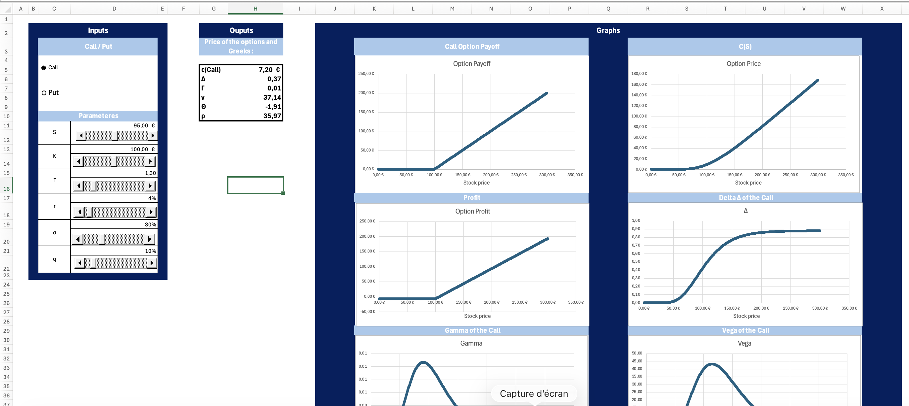
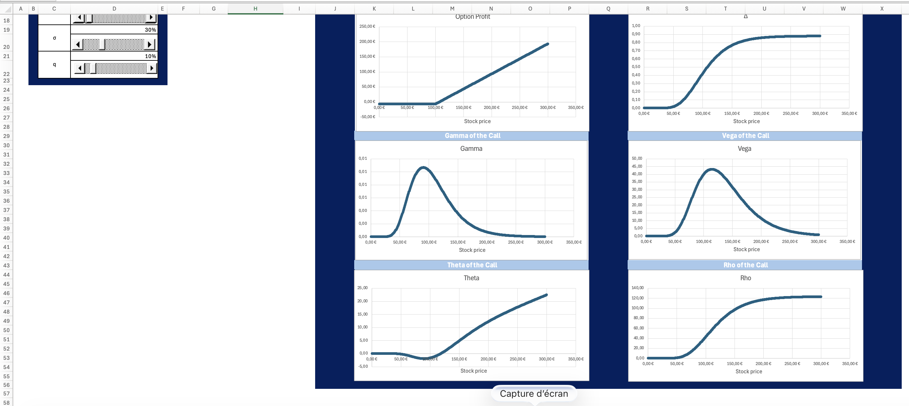

# Excel/VBA Option Pricing Dashboard

**A dashboard for pricing European options using the Black-Scholes-Merton model. This tool features real-time calculation of option Greeks and dynamic charting.**




---

## Features

* **Black-Scholes-Merton Pricer:** Calculates the theoretical price for European Calls and Puts
* **Full Greek Calculation:** Computes Delta, Gamma, Vega, Theta, and Rho in real-time
* **Interface 100% dynamique** avec curseurs (sliders) pour modifier les inputs (S, K, T, r, σ, q)
* **Real-Time Charts:** All graphs instantly update as parameters change:
    *Option Payoff at expiry
    *Profit & Loss (P&L) vs. Spot
    *Option Price C(S) vs. Spot
    *All Greeks vs. Spot 
---

## 🛠️ Comment l'utiliser (How to Use)

1.  Download the 'Option_Visualizer.xlsm' file from this repository
2.  Open the file in Excel
3.  You must enable macros when prompted by the security warning
4.  Use the sliders and Call/Put buttons to interact with the dashboard

---

##  VBA Code

```
Sub Calculation()
    Application.ScreenUpdating = False
    Dim wsDashboard As Worksheet
    Dim wsCalc As Worksheet
    Dim pas As Double
    Dim K As Double, S As Double, T As Double, r As Double, q As Double, sigma As Double
    Dim i As Long
    Dim price As Double
    Dim TypeOption As Integer
    Dim Smax As Double
    Dim NbrVal As Integer
    Dim S_current As Double
    
    Set wsCalc = Worksheets("Calculations")
    Set wsDashboard = Worksheets("Dashboard")
    
    K = wsDashboard.Range("D13").Value
    S = wsDashboard.Range("D11").Value
    T = wsDashboard.Range("D15").Value
    r = wsDashboard.Range("D17").Value
    sigma = wsDashboard.Range("D19").Value
    q = wsDashboard.Range("D21").Value
    TypeOption = wsDashboard.Range("D4").Value
    NbrVal = 500
    Smax = 3 * K
    pas = Smax / NbrVal
    
    price = BlackScholes(TypeOption, S, K, T, r, q, sigma)
    wsDashboard.Range("H5").Value = price
    wsDashboard.Range("H6").Value = Delta(TypeOption, S, K, T, r, q, sigma)
    wsDashboard.Range("H7").Value = Gamma(TypeOption, S, K, T, r, q, sigma)
    wsDashboard.Range("H8").Value = Vega(TypeOption, S, K, T, r, q, sigma)
    wsDashboard.Range("H9").Value = Theta(TypeOption, S, K, T, r, q, sigma)
    wsDashboard.Range("H10").Value = Rho(TypeOption, S, K, T, r, q, sigma)
    
    wsCalc.Range("C4:T2000").ClearContents
    If TypeOption = 1 Then
        wsCalc.Range("F4").Value = price
    Else
        wsCalc.Range("G4").Value = price
    End If
    
    For i = 1 To NbrVal
        S_current = i * pas
        wsCalc.Range("C" & (3 + i)).Value = S_current
        If TypeOption = 1 Then
            wsCalc.Range("D" & (3 + i)).Value = WorksheetFunction.Max(S_current - K, 0)
        Else
            wsCalc.Range("D" & (3 + i)).Value = WorksheetFunction.Max(K - S_current, 0)
        End If
        wsCalc.Range("I" & (3 + i)).Value = wsCalc.Range("D" & (3 + i)).Value - wsCalc.Range("F4").Value - wsCalc.Range("G4").Value
        wsCalc.Range("K" & (3 + i)).Value = BlackScholes(TypeOption, S_current, K, T, r, q, sigma)
        wsCalc.Range("M" & (3 + i)).Value = Delta(TypeOption, S_current, K, T, r, q, sigma)
        wsCalc.Range("N" & (3 + i)).Value = Gamma(TypeOption, S_current, K, T, r, q, sigma)
        wsCalc.Range("O" & (3 + i)).Value = Vega(TypeOption, S_current, K, T, r, q, sigma)
        wsCalc.Range("P" & (3 + i)).Value = Theta(TypeOption, S_current, K, T, r, q, sigma)
        wsCalc.Range("Q" & (3 + i)).Value = Rho(TypeOption, S_current, K, T, r, q, sigma)
    Next i
    
    Application.ScreenUpdating = True
End Sub

Function BlackScholes(ByVal TypeOption As Integer, ByVal S As Double, ByVal K As Double, ByVal T As Double, ByVal r As Double, ByVal q As Double, ByVal sigma As Double) As Double

    Dim d1 As Double, d2 As Double
    Dim price As Double

    If T <= 0 Or sigma <= 0 Then
        BlackScholes = 0
        Exit Function
    End If

    d1 = Calc_d1(S, K, T, r, q, sigma)
    d2 = Calc_d2(d1, T, sigma)

    If TypeOption = 1 Then
        price = S * CND(d1) * Exp(-q * T) - K * Exp(-r * T) * CND(d2)
    ElseIf TypeOption = 2 Then
        price = K * Exp(-r * T) * CND(-d2) - S * CND(-d1) * Exp(-q * T)
    Else
        price = 0
    End If

    BlackScholes = price

End Function

Private Function Calc_d1(S As Double, K As Double, T As Double, r As Double, q As Double, sigma As Double) As Double
    Calc_d1 = (Log(S / K) + (r - q + 0.5 * sigma ^ 2) * T) / (sigma * Sqr(T))
End Function

Private Function Calc_d2(d1 As Double, T As Double, sigma As Double) As Double
    Calc_d2 = d1 - sigma * Sqr(T)
End Function

Private Function CND(ByVal x As Double) As Double
    CND = Application.WorksheetFunction.Norm_S_Dist(x, True)
End Function

Public Function Delta(ByVal TypeOption As Integer, S As Double, K As Double, T As Double, r As Double, q As Double, sigma As Double) As Double
    If T <= 0 Or sigma <= 0 Then
        Delta = 0
        Exit Function
    End If

    Dim d1 As Double
    d1 = Calc_d1(S, K, T, r, q, sigma)

    If TypeOption = 1 Then
        Delta = Exp(-q * T) * CND(d1)
    Else
        Delta = Exp(-q * T) * (CND(d1) - 1)
    End If
End Function


Public Function Gamma(ByVal TypeOption As Integer, S As Double, K As Double, T As Double, r As Double, q As Double, sigma As Double) As Double
    If T <= 0 Or sigma <= 0 Then
        Gamma = 0
        Exit Function
    End If

    Dim d1 As Double
    d1 = Calc_d1(S, K, T, r, q, sigma)

    Gamma = Exp(-q * T) * WorksheetFunction.NormDist(d1, 0, 1, False) / (S * sigma * Sqr(T))
End Function

Public Function Vega(ByVal TypeOption As Integer, S As Double, K As Double, T As Double, r As Double, q As Double, sigma As Double) As Double
    If T <= 0 Or sigma <= 0 Then
        Vega = 0
        Exit Function
    End If

    Dim d1 As Double
    d1 = Calc_d1(S, K, T, r, q, sigma)

    Vega = S * Exp(-q * T) * WorksheetFunction.NormDist(d1, 0, 1, False) * Sqr(T)
End Function

Public Function Theta(ByVal TypeOption As Integer, S As Double, K As Double, T As Double, r As Double, q As Double, sigma As Double) As Double
    If T <= 0 Or sigma <= 0 Then
        Theta = 0
        Exit Function
    End If

    Dim d1 As Double
    Dim d2 As Double
    d1 = Calc_d1(S, K, T, r, q, sigma)
    d2 = Calc_d2(d1, T, sigma)

    If TypeOption = 1 Then
        Theta = -(S * Exp(-q * T) * WorksheetFunction.NormDist(d1, 0, 1, False) * sigma) / (2 * Sqr(T)) - r * K * Exp(-r * T) * CND(d2) + q * S * Exp(-q * T) * CND(d1)
                
    Else
        Theta = -(S * Exp(-q * T) * WorksheetFunction.NormDist(d1, 0, 1, False) * sigma) / (2 * Sqr(T)) + r * K * Exp(-r * T) * CND(-d2) - q * S * Exp(-q * T) * CND(-d1)
    End If
End Function

Public Function Rho(ByVal TypeOption As Integer, S As Double, K As Double, T As Double, r As Double, q As Double, sigma As Double) As Double
    If T <= 0 Or sigma <= 0 Then
        Rho = 0
        Exit Function
    End If

    Dim d1 As Double
    Dim d2 As Double
    d1 = Calc_d1(S, K, T, r, q, sigma)
    d2 = Calc_d2(d1, T, sigma)

    If TypeOption = 1 Then
        Rho = K * T * Exp(-r * T) * CND(d2)
    Else
        Rho = -K * T * Exp(-r * T) * CND(d2)
    End If
End Function
